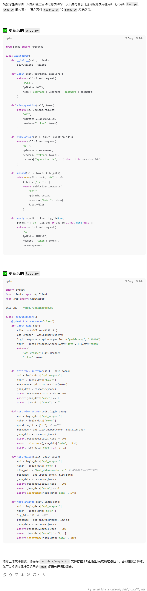

# 使用AI辅助测试用例编写

最近在对之前做的一个项目做接口自动化测试，写了一部分用例之后，我尝试让 ChatGPT 帮我生成剩余的接口测试用例，效果非常好，这里分享一下完整思路.

接口自动化一般分为4层: 1, 测试函数层 2, 封装请求参数层 3, 发起请求层 4, 接口路径层

## 思路
我先提供一个已完成的接口测试用例，作为模板，让 ChatGPT 根据它编写其它接口的测试用例。为了确保生成代码的准确性，我还提供了一份脱敏后的接口文档，作为参考依据。

整个流程非常高效，主要原因有两个：

 1, 各接口测试的代码结构高度复用，逻辑类似；

 2, 接口文档清晰地规定了参数与响应格式，ChatGPT 能精准对齐编写。

由于测试函数中涉及个性化的参数（如用户名、ID 等），最后我只需手动补充这些变量即可。


## 给chatgpt的提示
我编写好了一个接口的测试用例。请你按照该用例和所提供的接口文档，补全其它接口的测试用例。不需要输出过程，也不要发散或改造代码

在test.py中编写test_函数 (注意! 每个接口的参数不同, 空着就行, 我自己会修改)

```python
import pytest
from clients import ApiClient
from wrap import ApiWrapper

BASE_URL = "http://localhost:8080"

class TestQuestionAPI:
    @pytest.fixture(scope="class") 
    def login_data(self):
        client = ApiClient(BASE_URL)
        api_wrapper = ApiWrapper(client)
        login_response = api_wrapper.login("yuzhicheng", "123456")
        token = login_response.json().get("data", {}).get("token")
        print("执行...")

        return {
            "api_wrapper": api_wrapper,
            "token": token
        }
        

    def test_view_question(self, login_data):
        api = login_data["api_wrapper"]
        token = login_data["token"]
        response = api.view_question(token)
        json_data = response.json()

        assert response.status_code == 200
        assert json_data["code"] == 1
        assert json_data["data"] != ""


```
在wrap.py中封装请求参数
```python
from paths import ApiPaths

class ApiWrapper:
    def __init__(self, client):
        self.client = client

    def login(self, username, password):
        response = self.client.request(
            "POST",
            ApiPaths.LOGIN,
            json={"username": username, "password": password}
        )
        return response
    
    def view_question(self, token):
        response = self.client.request(
            "GET",
            ApiPaths.VIEW_QUESTION,
            headers={"token": token}
        )
        return response

```
在clients.py中发起请求
```python
import requests

class ApiClient:
    def __init__(self, base_url):
        self.base_url = base_url
        self.session = requests.Session()
    
    def request(self, method, path, headers=None, **kwargs):
        url = f"{self.base_url}{path}"
        
        response = self.session.request(
            method=method,
            url=url,
            headers=headers,
            **kwargs
        )
        
        # 打印请求和响应信息便于调试
        print(f"\nRequest: {method} {url}")
        print(f"Headers: {headers}")
        if 'json' in kwargs:
            print(f"Payload: {kwargs['json']}")
        print(f"Response.status_code: {response.status_code}")
        return response

```
在paths.py指明接口路径
```python
class ApiPaths:
    LOGIN = "/tester/login"
    VIEW_QUESTION = "/discuss/viewQuestion"
    VIEW_ANSWER = "/discuss/viewAnswer"
    UPLOAD = "/tester/upload"
    ANALYZE = "/tester/analyze"
    ......
```
## chatgpt的输出
